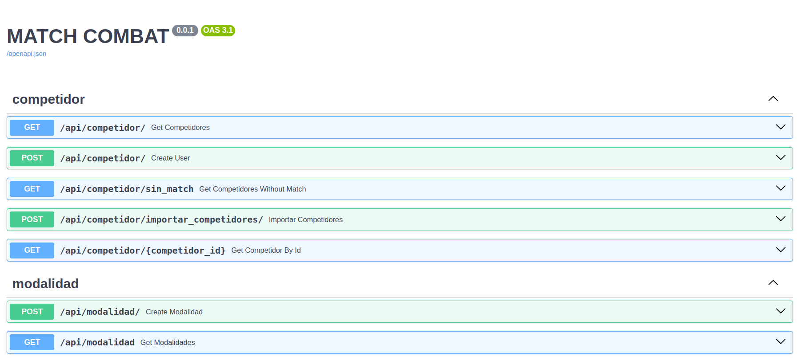

# Match Combat - Gerardo Benitez

A project that aims to solve the problem of finding openers for contact sports events, given a list of competitors and 
based on criteria such as gender, weight, and experience, to be able to select the best options for each competitor, and
then create matches and eliminate from the options the competitors who already have a fight "arranged."

Un proyecto que pretende resolver la problemática de buscar openentes para eventos de deportes de contacto, dado un 
lista de competidores, y basandose en criterios como el sexo, el peso, la experiencia, poder seleccionar las mejores 
opciones para cada competidor, y luego crear los matchs y sacar de las opciones a los competidores que ya tienen pelea 
"armada".

## Technologies 

* FastAPI
* Docker
* SQLModel (SqlAchemy)
* PostgreSql / SQLite

## Requirements

Python 3.9+

## Project

### Setup environment
1. copy .env.example to .env
2. set environment variables

### Run It: option 1 with docker

1. Start the project 

```sh
docker-compose up
```

### Run It: option 2 manually
1. Start Postgres DB
   ```sh
   docker-compose up postgres
   ```
2. Start api
   ```sh
   python3 -m venv .venv
   source .venv/bin/activate
   pip install requirements.txt
   set -a
   source .env
   set +a
   uvicorn app.main:app --host 0.0.0.0 --port 9009 --reload
   
   ```

### Logs
The applications logs are located in 
```
./logs/app.logs
```

#### Api Documentation
Go to [http://localhost:9009/docs](http://localhost:9009/docs).



