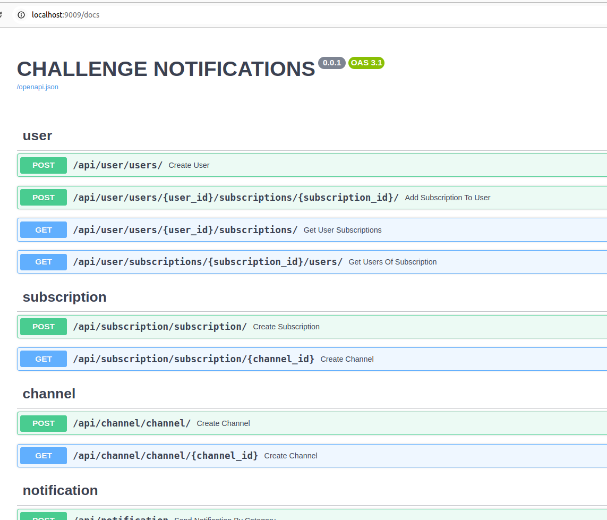

# Match Combat - Gerardo Benitez
Un proyecto que pretende resolver la problemática de buscar openentes 
para eventos de deportes de contacto, dado un lista de competidores, 
y basandose en criterios como el sexo, el peso, la experiencia, poder seleccionar
las mejores opciones para cada competidor, y luego crear los matchs y sacar de las
opciones a los competidores que ya tienen pelea "armada".


* FastAPI
* Docker
* SQLModel (SqlAchemy)
* PostgreSql / SQLite

## Requirements

Python 3.9+

## Project

### Setup environment
1. copy .env.example to .env
2. set environment variables

### Run It: option 1 with docker

1. Start the project 

```sh
docker-compose up
```

### Run It: option 2 manually
1. Start Postgres DB
   ```sh
   docker-compose up postgres
   ```
2. Start api
   ```sh
   python3 -m venv .venv
   source .venv/bin/activate
   pip install -r requirements.txt
   set -a
   source .env
   set +a
   uvicorn app.main:app --host 0.0.0.0 --port 9009 --reload
   
   ```

### Option 3: run using pm2
   ```
   pm2 start ./venv/bin/uvicorn --name "mi-api" -- app.main:app --port 9009
   ```
   
### Logs
The applications logs are located in 
```
./logs/app.logs
```

### Working

#### Try Api using curl
```
curl --location --request POST 'http://localhost:9009/api/notification' \
--header 'Content-Type: application/json' \
--data-raw '{
    "category": "films", 
    "message": "Dec 24, world premiere of the movie Avatar 3"
}'
```

#### Api Documentation
Go to [http://localhost:9009/docs](http://localhost:9009/docs).



